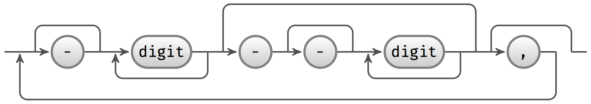
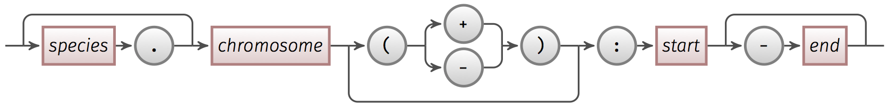
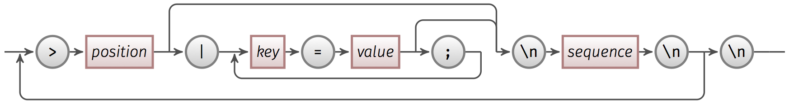

# withncbi

withncbi - batch operations according to various NCBI/EBI databases.

## Purpose

Fetch sequences, generate reports and build alignments according to various NCBI databases.

For more detailed, check `README.md` in each sub-directories.

## Directory organization

* [`db/`](db/): turn NCBI genome reports and assembly reports into a query-able MySQL database.

* [`ensembl/`](ensembl/): Ensembl related scripts.

* [`misc/`](misc/): miscellaneous projects.

* [`pop/`](pop/): build alignments on an whole Eukaryotes genus.

* [`taxon/`](taxon/): process (small) genomes according to NCBI Taxonomy.

* [`util/`](util/): miscellaneous utilities.

## Concepts

### IntSpans

An IntSpan represents sets of integers as a number of inclusive ranges, for example
'1-10,19,45-48'.

The following picture is the schema of an IntSpan object. Jump lines are above the baseline; loop
lines are below it.



[AlignDB::IntSpan](https://github.com/wang-q/AlignDB-IntSpan) and
[jintspan](https://github.com/egateam/jintspan) are implements of IntSpan objects in Perl and Java,
respectively.

### Positions

Examples in [`S288c.txt`](https://github.com/wang-q/App-RL/blob/master/t/S288c.txt)

```text
I:1-100
I(+):90-150
S288c.I(-):190-200
II:21294-22075
II:23537-24097
```

 

Simple rules:

* `chromosome` and `start` are required
* `species`, `strand` and `end` are optional
* `.` to separate `species` and `chromosome`
* `strand` is one of `+` and `-` and surround by round brackets
* `:` to separate names and digits
* `-` to separate `start` and `end`
* names should be alphanumeric and without spaces

```text
species.chromosome(strand):start-end
--------^^^^^^^^^^--------^^^^^^----
```

### Runlists in YAML

[App::RL](https://github.com/wang-q/App-RL)

[jrunlist](https://github.com/egateam/jrunlist)

### Blocked fasta files

Examples in [`example.fas`](https://github.com/wang-q/App-Fasops/blob/master/t/example.fas)

```text
>S288c.I(+):13267-13287|species=S288c
TCGTCAGTTGGTTGACCATTA
>YJM789.gi_151941327(-):5668-5688|species=YJM789
TCGTCAGTTGGTTGACCATTA
>RM11.gi_61385832(-):5590-5610|species=RM11
TCGTCAGTTGGTTGACCATTA
>Spar.gi_29362400(+):2477-2497|species=Spar
TCATCAGTTGGCAAACCGTTA

```



[App::Fasops](https://github.com/wang-q/App-Fasops)

### Ranges and links of ranges

[App::Rangeops](https://github.com/wang-q/App-Rangeops)

[jrange](https://github.com/egateam/jrange)

## Author

Qiang Wang &lt;wang-q@outlook.com&gt;

## Copyright and license

This software is copyright (c) 2015 by Qiang Wang.

This is free software; you can redistribute it and/or modify it under the same terms as the Perl 5
programming language system itself.
