# RNases from Tenericutes


[TOC levels=1-3]: # ""

- [RNases from Tenericutes](#rnases-from-tenericutes)
- [Phylum Tenericutes and outgroups](#phylum-tenericutes-and-outgroups)
  - [Download from NCBI assembly](#download-from-ncbi-assembly)
  - [NCBI taxonomy](#ncbi-taxonomy)
  - [Count strains](#count-strains)
- [Some packages needed](#some-packages-needed)
- [Collect proteins](#collect-proteins)
  - [`all.pro.fa`](#allprofa)
  - [`all.replace.fa`](#allreplacefa)
  - [`all.info.tsv`](#allinfotsv)
- [Phylogenetics with 40 single-copy genes, *RpoB*, *EF-tu* and RNase_R](#phylogenetics-with-40-single-copy-genes-rpob-ef-tu-and-rnase_r)
  - [Find corresponding proteins by `hmmsearch`](#find-corresponding-proteins-by-hmmsearch)
  - [Create valid marker gene list](#create-valid-marker-gene-list)
  - [Align and concat marker genes to create species tree](#align-and-concat-marker-genes-to-create-species-tree)
  - [Tweak the concat tree](#tweak-the-concat-tree)
  - [TIGR](#tigr)
- [Essential genes](#essential-genes)
- [Bacteria degradosomes](#bacteria-degradosomes)
  - [Components of the RNA degradosome in E. coli](#components-of-the-rna-degradosome-in-e-coli)
  - [The Gram-Positive Bacterial RNA Degradosome](#the-gram-positive-bacterial-rna-degradosome)
  - [Proteins containing S1 domain in E. coli](#proteins-containing-s1-domain-in-e-coli)
  - [Other RNases](#other-rnases)
- [Intriguing domains](#intriguing-domains)
  - [Domain organisation of RNase R](#domain-organisation-of-rnase-r)
    - [E. coli RNase R](#e-coli-rnase-r)
    - [E. coli RNase II](#e-coli-rnase-ii)
    - [Human RRP44](#human-rrp44)
    - [Fly Dis3](#fly-dis3)
    - [Yeast RRP44](#yeast-rrp44)
    - [Arabidopsis thaliana RP44A](#arabidopsis-thaliana-rp44a)
  - [hmmer.org HMMSCAN Results](#hmmerorg-hmmscan-results)
  - [Domains of RNases and Cooperators](#domains-of-rnases-and-cooperators)
  - [Scan every domains](#scan-every-domains)
  - [InterProScan](#interproscan)
- [*Mycoplasma* degradosomes and RNases](#mycoplasma-degradosomes-and-rnases)
- [We can't trust annotations](#we-cant-trust-annotations)
  - [Stats of annotations and HMM models of RNase R](#stats-of-annotations-and-hmm-models-of-rnase-r)
- [Find RNases and Cooperators](#find-rnases-and-cooperators)
  - [Find all RNase R](#find-all-rnase-r)
  - [Tweak the tree of RNaseR](#tweak-the-tree-of-rnaser)
  - [RNB domain](#rnb-domain)
  - [Importin_rep domain](#importin_rep-domain)
- [Collect CDS](#collect-cds)
  - [`all.cds.fa`](#allcdsfa)
  - [`RNaseR.cds.fa`](#rnasercdsfa)
- [Tenericutes: run](#tenericutes-run)


# Phylum Tenericutes and outgroups

无壁菌门, 或称柔膜菌门, 无细胞壁

Ref.:

1. Skennerton, C. T. et al. Phylogenomic analysis of Candidatus Izimaplasma species: free-living
   representatives from a Tenericutes clade found in methane seeps. ISME J. 10, 2679-2692 (2016).

2. Davis, J. J., Xia, F., Overbeek, R. A. & Olsen, G. J. Genomes of the class Erysipelotrichia
   clarify the firmicute origin of the class Mollicutes. Int. J. Syst. Evol. Microbiol. 63,
   2727-2741 (2013).

Key genera:

* Acholeplasmatales
  * *Acholeplasma*: 2147
  * *Candidatus Phytoplasma*: 33926

* Anaeroplasmatales
  * *Anaeroplasma*: 2086
  * *Asteroleplasma*: 2152

* Entomoplasmatales
  * *Entomoplasma*: 46238
  * *Mesoplasma*: 46239
  * *Spiroplasma*: 2132

* Mycoplasmatales
  * *Mycoplasma*: 2093
  * *Ureaplasma*: 2129
  * *Candidatus Hepatoplasma*: 295595

* *Candidatus Izimaplasma*: 1912503

* Haloplasmatales
  * *Haloplasma*: 471824
  * *Inordinaticella*: 1979191

Outgroup:

* Firmicutes
  * Bacillus subtilis subsp. subtilis str. 168: 224308
  * Staphylococcus aureus subsp. aureus NCTC 8325: 93061
  * Erysipelothrix rhusiopathiae str. Fujisawa: 650150
  * Clostridium acetobutylicum ATCC 824: 272562
  * Clostridium tetani E88: 212717

* Actinobacteria
  * Amycolatopsis mediterranei U32: 749927
  * Bifidobacterium adolescentis ATCC 15703: 367928
  * Corynebacterium glutamicum ATCC 13032: 196627

* Alphaproteobacteria
  * Brucella melitensis bv. 1 str. 16M: 224914

* Betaproteobacteria
  * Neisseria gonorrhoeae FA 1090: 242231

* Gammaproteobacteria
  * Escherichia coli str. K-12 substr. MG1655: 511145
  * Salmonella enterica subsp. enterica serovar Typhimurium str. LT2: 99287
  * Pseudomonas aeruginosa PAO1: 208964
  * Pseudomonas putida KT2440: 160488

* delta/epsilon subdivisions
  * Helicobacter pylori 26695: 85962

Check NCBI pages:

* http://www.ncbi.nlm.nih.gov/assembly/?term=txid2093%5BOrganism:exp%5D
* http://www.ncbi.nlm.nih.gov/genome/?term=txid2093%5BOrganism:exp%5D

## Download from NCBI assembly

```shell script
export RANK_NAME=Tenericutes

mkdir -p ~/data/alignment/${RANK_NAME}        # Working directory
cd ~/data/alignment/${RANK_NAME}

mysql -ualignDB -palignDB ar_refseq -e "
    SELECT
        organism_name, species, genus, ftp_path, assembly_level
    FROM ar
    WHERE 1=1
        AND genus_id in (2147, 33926, 2086, 2152, 46238, 46239, 2132, 2093, 2129, 295595, 1912503, 471824, 1979191)
    " \
    > raw.tsv

mysql -ualignDB -palignDB ar_refseq -e "
    SELECT
        organism_name, species, genus, ftp_path, assembly_level
    FROM ar
    WHERE 1=1
        AND taxonomy_id in (224308, 93061, 650150, 272562, 212717, 749927, 367928, 196627)
    " \
    >> raw.tsv

mysql -ualignDB -palignDB ar_refseq -e "
    SELECT
        organism_name, species, genus, ftp_path, assembly_level
    FROM ar
    WHERE 1=1
        AND taxonomy_id in (224914, 242231, 511145, 99287, 208964, 160488, 85962)
    " \
    >> raw.tsv

mysql -ualignDB -palignDB ar_genbank -e "
    SELECT
        organism_name, species, genus, ftp_path, assembly_level
    FROM ar
    WHERE 1=1
        AND genus_id in (2147, 33926, 2086, 2152, 46238, 46239, 2132, 2093, 2129, 295595, 1912503, 471824, 1979191)
    " \
    >> raw.tsv

cat raw.tsv |
    grep -v '^#' |
    perl ~/Scripts/withncbi/taxon/abbr_name.pl -c "1,2,3" -s '\t' -m 3 --shortsub |
    (echo -e '#name\tftp_path\torganism\tassembly_level' && cat ) |
    perl -nl -a -F"," -e '
        BEGIN{my %seen};
        /^#/ and print and next;
        /^organism_name/i and next;
        $seen{$F[5]}++;
        $seen{$F[5]} > 1 and next;
        printf qq{%s\t%s\t%s\t%s\n}, $F[5], $F[3], $F[1], $F[4];
        ' |
    keep-header -- sort -k3,3 -k1,1 \
    > ${RANK_NAME}.assembly.tsv

# comment out unneeded assembly levels

# find potential duplicated strains or assemblies
cat ${RANK_NAME}.assembly.tsv |
    cut -f 1 |
    sort |
    uniq -c |
    sort -nr

# Edit .tsv, remove unnecessary strains, check strain names and comment out poor assemblies.

# Remove uncertain species like Acholeplasma sp.
# Move outgroups to the bottom.

# vim ${RANK_NAME}.assembly.tsv
# cp ${RANK_NAME}.assembly.tsv ~/Scripts/withncbi/pop

# Cleaning
rm raw*.*sv

unset RANK_NAME

```

```shell script
cd ~/data/alignment/Tenericutes

perl ~/Scripts/withncbi/taxon/assembly_prep.pl \
    -f ~/Scripts/withncbi/pop/Tenericutes.assembly.tsv \
    -o ASSEMBLY

bash ASSEMBLY/Tenericutes.assembly.rsync.sh

bash ASSEMBLY/Tenericutes.assembly.collect.sh

```

## NCBI taxonomy

```shell script
cd ~/data/alignment/Tenericutes

bp_taxonomy2tree.pl -e \
    -s "Acholeplasma" \
    -s "Anaeroplasma" \
    -s "Asteroleplasma" \
    -s "Entomoplasma" \
    -s "Haloplasma" \
    -s "Hepatoplasma" \
    -s "Inordinaticella" \
    -s "Izimaplasma" \
    -s "Mesoplasma" \
    -s "Mycoplasma" \
    -s "Phytoplasma" \
    -s "Spiroplasma" \
    -s "Ureaplasma" \
    -s "Bacillus subtilis" \
    -s "Staphylococcus aureus" \
    -s "Eubacterium limosum" \
    -s "Erysipelothrix rhusiopathiae" \
    -s "Clostridium acetobutylicum" \
    -s "Clostridium tetani" \
    -s "Amycolatopsis mediterranei" \
    -s "Bifidobacterium adolescentis" \
    -s "Corynebacterium glutamicum" \
    -s "Mycobacterium tuberculosis" \
    -s "Brucella melitensis" \
    -s "Neisseria gonorrhoeae" \
    -s "Escherichia coli" \
    -s "Salmonella enterica" \
    -s "Pseudomonas aeruginosa" \
    -s "Pseudomonas putida" \
    -s "Helicobacter pylori" \
    > Tenericutes.newick

nw_display -w 600 -s Tenericutes.newick |
    rsvg-convert -o ~/Scripts/withncbi/image/Tenericutes.png

```


## Count strains

```shell script
cd ~/data/alignment/Tenericutes

parallel --no-run-if-empty --linebuffer -k -j 4 '
    n_species=$(cat ASSEMBLY/Tenericutes.assembly.collect.csv |
        cut -d"," -f 2 |
        grep -v "Candidatus" |
        grep "{}" |
        cut -d" " -f 1,2 |
        sort |
        uniq |
        wc -l)

    n_strains=$(cat ASSEMBLY/Tenericutes.assembly.collect.csv |
        cut -d"," -f 2 |
        grep -v "Candidatus" |
        grep "{}" |
        cut -d" " -f 1,2 |
        sort |
        wc -l)

    printf "%s\t%d\t%d\n" {} ${n_species} ${n_strains}
    ' ::: Acholeplasma Entomoplasma Mesoplasma Spiroplasma Mycoplasma Ureaplasma

#Acholeplasma	10	13
#Entomoplasma	6	10
#Mesoplasma	11	15
#Spiroplasma	28	31
#Mycoplasma	95	217
#Ureaplasma	4	25

mkdir -p taxon

echo "An_bac" > taxon/Anaeroplasma
echo "Ha_cont_SSD_17B" > taxon/Haloplasma
echo "I_for" > taxon/Inordinaticella
#echo "CH_crin_Av" > taxon/Hepatoplasma

#cat <<EOF > taxon/Izimaplasma
#CI_sp_HR1
#CI_sp_HR2
#CI_sp_Z
#EOF

cat <<EOF > taxon/Phytoplasma
CP_Ast_AYWB
CP_Bra
CP_aus
CP_Cat
CP_Chrysanthemum_c
CP_Chrysanthemum_y
CP_Cyn
CP_Ech
CP_Ita_MA1
CP_Mai
CP_Mil_MW1
CP_New
CP_Oni_OY_M
CP_Par
CP_Pea_NTU2011
CP_Per
CP_Poi_JR1
CP_Rap
CP_Ric
CP_Sac
CP_Vac_VAC
CP_Whe
EOF

parallel --no-run-if-empty --linebuffer -k -j 4 '
    cat ASSEMBLY/Tenericutes.assembly.collect.csv |
        cut -d"," -f 1,2 |
        grep "{}" |
        cut -d"," -f 1 \
        > taxon/{}
    ' ::: Acholeplasma Entomoplasma Mesoplasma Spiroplasma Mycoplasma Ureaplasma

cat <<EOF > taxon/Firmicutes
Ba_subt_subtilis_168
Cl_ace_ATCC_824
Cl_tet_E88
Er_rhu_Fujisawa
St_aure_aureus_NCTC_8325
EOF

cat <<EOF > taxon/Actinobacteria
Am_med_U32
Bi_ado_ATCC_15703
Co_glu_ATCC_13032
EOF

cat <<EOF > taxon/Proteobacteria
Br_meli_bv_1_16M
Es_coli_K_12_MG1655
He_pyl_26695
N_gon_FA_1090
P_aer_PAO1
P_puti_KT2440
Sa_ente_enterica_Typhimurium_LT2
EOF

wc -l taxon/*

find taxon -maxdepth 1 -type f -not -name "*.replace.tsv" |
    xargs -I{} basename {} |
    sort \
    > genus.list

# Omit strains without protein annotations
#My_arg_ATCC_23838
#My_moa_ATCC_27625
#My_myc_capri_G1201
for GENUS in $(cat genus.list); do
    for STRAIN in $(cat taxon/${GENUS}); do
        if ! compgen -G "ASSEMBLY/${STRAIN}/*_protein.faa.gz" > /dev/null; then
            echo ${STRAIN}
        fi
        if ! compgen -G "ASSEMBLY/${STRAIN}/*_cds_from_genomic.fna.gz" > /dev/null; then
            echo ${STRAIN}
        fi
    done
done |
    uniq \
    > omit.list

# Remove lines in taxon/${GENUS}
for GENUS in $(cat genus.list); do
    perl -nl -i -MPath::Tiny -e '
        BEGIN {
            our %omit = map { $_ => 1 }
                        grep {/\S/}
                        path(q{omit.list})->lines({ chomp => 1});
        }
        print $_ if ! exists $omit{$_};
    ' taxon/${GENUS}
done

```

| Order             | Genus           | Comments           | Species | Strains |
|:------------------|:----------------|:-------------------|--------:|--------:|
| Acholeplasmatales |                 |                    |         |         |
|                   | Acholeplasma    | 无胆甾原体           |      10 |      13 |
|                   | Phytoplasma     | 植原体              |         |      22 |
| Anaeroplasmatales |                 |                    |         |         |
|                   | Anaeroplasma    |                    |       1 |       1 |
|                   | Asteroleplasma  |                    |         |         |
| Entomoplasmatales |                 | 虫原体              |         |         |
|                   | Entomoplasma    |                    |       6 |      10 |
|                   | Mesoplasma      |                    |      11 |      15 |
|                   | Spiroplasma     | 螺原体, 感染昆虫与植物 |      28 |      31 |
| Mycoplasmatales   |                 |                    |         |         |
|                   | Mycoplasma      | 支原体              |      95 |     217 |
|                   | Ureaplasma      | 脲原体              |       4 |      25 |
|                   | Hepatoplasma    |                    |         |         |
| Unclassified      |                 |                    |         |         |
|                   | Izimaplasma     | 独立生活             |         |         |
| Haloplasmatales   |                 |                    |         |         |
|                   | Haloplasma      |                    |       1 |       1 |
|                   | Inordinaticella |                    |       1 |       1 |

# Some packages needed

```shell script
brew install hmmer
brew install librsvg

brew install brewsci/bio/muscle
brew install brewsci/bio/fasttree
brew install brewsci/bio/easel
brew install brewsci/bio/newick-utils

brew install datamash
brew install miller
brew install wang-q/tap/tsv-utils

brew install jq
brew install pup

```

# Collect proteins

## `all.pro.fa`

```shell script
cd ~/data/alignment/Tenericutes

mkdir -p PROTEINS

# 351
find ASSEMBLY -maxdepth 1 -type d |
    sort |
    grep 'ASSEMBLY/' |
    wc -l

# 348
find ASSEMBLY -type f -name "*_protein.faa.gz" |
    wc -l

for GENUS in $(cat genus.list); do
    echo 1>&2 "==> GENUS [${GENUS}]"

    for STRAIN in $(cat taxon/${GENUS}); do
        gzip -dcf ASSEMBLY/${STRAIN}/*_protein.faa.gz
    done
done \
    > PROTEINS/all.pro.fa

# ribonuclease
cat PROTEINS/all.pro.fa |
    grep "ribonuclease" |
    grep -v "deoxyribonuclease" |
    perl -nl -e 's/^>\w+\.\d+\s+//g; print' |
    perl -nl -e 's/\s+\[.+?\]$//g; print' |
    perl -nl -e 's/MULTISPECIES: //g; print' |
    sort |
    uniq -c |
    sort -nr

# methyltransferase
cat PROTEINS/all.pro.fa |
    grep "methyltransferase" |
    perl -nl -e 's/^>\w+\.\d+\s+//g; print' |
    perl -nl -e 's/\s+\[.+?\]$//g; print' |
    perl -nl -e 's/MULTISPECIES: //g; print' |
    sort |
    uniq -c |
    sort -nr

```

## `all.replace.fa`

```shell script
cd ~/data/alignment/Tenericutes

rm PROTEINS/all.strain.tsv
for GENUS in $(cat genus.list); do
    echo 1>&2 "==> GENUS [${GENUS}]"

    for STRAIN in $(cat taxon/${GENUS}); do
        gzip -dcf ASSEMBLY/${STRAIN}/*_protein.faa.gz |
            grep "^>" |
            cut -d" " -f 1 |
            sed "s/^>//" |
            STRAIN=${STRAIN} perl -nl -e '
                $n = $_;
                $s = $n;
                $s =~ s/\.\d+//;
                printf qq{%s\t%s_%s\t%s\n}, $n, $ENV{STRAIN}, $s, $ENV{STRAIN};
            ' \
        > PROTEINS/${STRAIN}.replace.tsv

        cut -f 2,3 PROTEINS/${STRAIN}.replace.tsv >> PROTEINS/all.strain.tsv

        faops replace -s ASSEMBLY/${STRAIN}/*_protein.faa.gz <(cut -f 1,2 PROTEINS/${STRAIN}.replace.tsv) stdout

        rm PROTEINS/${STRAIN}.replace.tsv
    done
done \
    > PROTEINS/all.replace.fa

# counting proteins
cat PROTEINS/all.pro.fa |
    grep "^>" |
    wc -l
#315324

cat PROTEINS/all.replace.fa |
    grep "^>" |
    wc -l
#315324

rm -fr temp
(echo -e "#name\tstrain" && cat PROTEINS/all.strain.tsv)  \
    > temp && mv temp PROTEINS/all.strain.tsv

faops size PROTEINS/all.replace.fa > PROTEINS/all.replace.sizes

(echo -e "#name\tsize" && cat PROTEINS/all.replace.sizes) > PROTEINS/all.size.tsv

rm PROTEINS/all.replace.sizes

```

## `all.info.tsv`

```shell script
cd ~/data/alignment/Tenericutes

for GENUS in $(cat genus.list); do
    echo 1>&2 "==> GENUS [${GENUS}]"

    for STRAIN in $(cat taxon/${GENUS}); do
        gzip -dcf ASSEMBLY/${STRAIN}/*_protein.faa.gz |
            grep "^>" |
            sed "s/^>//" |
            perl -nl -e '/\[.+\[/ and s/\[/\(/; print' |
            perl -nl -e '/\].+\]/ and s/\]/\)/; print' |
            perl -nl -e 's/\s+\[.+?\]$//g; print' |
            perl -nl -e 's/MULTISPECIES: //g; print' |
            STRAIN=${STRAIN} perl -nl -e '
                /^(\w+)\.\d+\s+(.+)$/ or next;
                printf qq{%s_%s\t%s\n}, $ENV{STRAIN}, $1, $2;
            '
    done
done \
    > PROTEINS/all.annotation.tsv

cat PROTEINS/all.annotation.tsv |
    wc -l
#315324

rm -fr temp
(echo -e "#name\tannotation" && cat PROTEINS/all.annotation.tsv) \
    > temp && mv temp PROTEINS/all.annotation.tsv

# check differences
cat PROTEINS/all.size.tsv |
    grep -F -f <(cut -f 1 PROTEINS/all.annotation.tsv) -v

tsv-join \
    PROTEINS/all.strain.tsv \
    --data-fields 1 \
    -f PROTEINS/all.size.tsv \
    --key-fields 1 \
    --append-fields 2 \
    > PROTEINS/all.strain_size.tsv

tsv-join \
    PROTEINS/all.strain_size.tsv \
    --data-fields 1 \
    -f PROTEINS/all.annotation.tsv \
    --key-fields 1 \
    --append-fields 2 \
    > PROTEINS/all.info.tsv

cat PROTEINS/all.info.tsv |
    wc -l
#315325

```

# Phylogenetics with 40 single-copy genes, *RpoB*, *EF-tu* and RNase_R

## Find corresponding proteins by `hmmsearch`

* Download need hmm models in [`hmm/README.md`](../hmm/README.md)

* The `E_VALUE` was manually adjusted to 1e-20 to reach a balance between sensitivity and
  speciality.

* RpoB: TIGR02013
* EF-tu: TIGR00485

```shell script
E_VALUE=1e-20

cd ~/data/alignment/Tenericutes

## example
#gzip -dcf ASSEMBLY/Ac_axa_ATCC_25176/*_protein.faa.gz |
#    hmmsearch -E 1e-20 --domE 1e-20 --noali --notextw ~/data/HMM/40scg/bacteria_and_archaea_dir/BA00001.hmm - |
#    grep '>>' |
#    perl -nl -e '/>>\s+(\S+)/ and print $1'

# Find all genes
for marker in BA000{01..40}; do
    echo "==> marker [${marker}]"

    mkdir -p PROTEINS/${marker}

    for GENUS in $(cat genus.list); do
        echo "==> GENUS [${GENUS}]"

        for STRAIN in $(cat taxon/${GENUS}); do
            gzip -dcf ASSEMBLY/${STRAIN}/*_protein.faa.gz |
                hmmsearch -E ${E_VALUE} --domE ${E_VALUE} --noali --notextw ~/data/HMM/40scg/bacteria_and_archaea_dir/${marker}.hmm - |
                grep '>>' |
                STRAIN=${STRAIN} perl -nl -e '
                    />>\s+(\S+)/ and printf qq{%s\t%s\n}, $1, $ENV{STRAIN};
                '
        done \
            > PROTEINS/${marker}/${GENUS}.replace.tsv
    done

    echo
done

for marker in TIGR02013 TIGR00485; do
    echo "==> marker [${marker}]"

    mkdir -p PROTEINS/${marker}

    for GENUS in $(cat genus.list); do
        echo "==> GENUS [${GENUS}]"

        for STRAIN in $(cat taxon/${GENUS}); do
            gzip -dcf ASSEMBLY/${STRAIN}/*_protein.faa.gz |
                hmmsearch -E ${E_VALUE} --domE ${E_VALUE} --noali --notextw ~/data/HMM/TIGRFAM/HMM/${marker}.HMM - |
                grep '>>' |
                STRAIN=${STRAIN} perl -nl -e '
                    />>\s+(\S+)/ or next;
                    $n = $1;
                    $s = $n;
                    $s =~ s/\.\d+//;
                    printf qq{%s\t%s_%s\n}, $n, $ENV{STRAIN}, $s;
                '
        done \
            > PROTEINS/${marker}/${GENUS}.replace.tsv
    done

    echo
done

```

## Create valid marker gene list

* `hmmsearch` may identify more than one copy for some marker genes.

  * BA00005: translation initiation factor IF-2
  * BA00008: signal recognition particle protein
  * BA00013: phenylalanine--tRNA ligase subunit beta

  * TIGR02013: the beta subunit of Bacterial RNA polymerase
  * TIGR00485: translation elongation factor EF-Tu

* Misidentified marker genes

  * BA00004: translation initiation factor EF-2

* Missing from many strains

  * BA00022: ribosomal protein L25/L23
  * BA00027: ribosomal protein L29
  * BA00032: tRNA pseudouridine synthase B
  * BA00035: Porphobilinogen deaminase
  * BA00038: phosphoribosylformylglycinamidine cyclo-ligase
  * BA00039: ribonuclease HII
  * BA00040: ribosomal protein L24

Compare proteins and strains.

```shell script
cd ~/data/alignment/Tenericutes

for marker in BA000{01..03} BA000{06..07} BA000{09..12} BA000{14..21} BA000{23..26} BA000{28..31} BA000{33..34} BA000{36..37}; do
    echo ${marker}
done > marker.list

for marker in $(cat marker.list); do
    echo "==> marker [${marker}]"

    for GENUS in $(cat genus.list); do
        cat PROTEINS/${marker}/${GENUS}.replace.tsv |
            cut -f 2 |
            diff - taxon/${GENUS}
    done

    echo
done

```

## Align and concat marker genes to create species tree

```shell script
cd ~/data/alignment/Tenericutes

# extract sequences
for marker in $(cat marker.list) TIGR02013 TIGR00485; do
    echo "==> marker [${marker}]"

    for GENUS in $(cat genus.list); do
        echo "==> GENUS [${GENUS}]"

        mytmpdir=`mktemp -d 2>/dev/null || mktemp -d -t 'mytmpdir'`

        # avoid duplicated fasta headers
        faops some PROTEINS/all.pro.fa PROTEINS/${marker}/${GENUS}.replace.tsv stdout |
            faops filter -u stdin ${mytmpdir}/${GENUS}.fa

        # avoid duplicated original names
        cat PROTEINS/${marker}/${GENUS}.replace.tsv |
            parallel --no-run-if-empty --linebuffer -k -j 1 "
                faops replace -s ${mytmpdir}/${GENUS}.fa <(echo {}) stdout
            " \
            > PROTEINS/${marker}/${GENUS}.pro.fa

        rm -fr ${mytmpdir}
    done

    echo
done

for marker in $(cat marker.list) TIGR02013 TIGR00485; do
    echo "==> marker [${marker}]"

    for GENUS in $(cat genus.list); do
        cat PROTEINS/${marker}/${GENUS}.pro.fa
    done \
        > PROTEINS/${marker}/${marker}.pro.fa
done

# aligning each markers with muscle
cat marker.list |
    parallel --no-run-if-empty --linebuffer -k -j 4 "
        echo '==> {}'

        muscle -quiet -in PROTEINS/{}/{}.pro.fa -out PROTEINS/{}/{}.aln.fa
    "

# concat marker genes
for marker in $(cat marker.list); do
    # sequences in one line
    faops filter -l 0 PROTEINS/${marker}/${marker}.aln.fa stdout

    # empty line for .fas
    echo
done \
    > PROTEINS/markers.aln.fas

cat PROTEINS/markers.aln.fas |
    grep "^>" |
    sed "s/^>//" |
    sort |
    uniq \
    > strains.list
fasops concat PROTEINS/markers.aln.fas strains.list -o PROTEINS/concat.aln.fa

# FastTree produces NJ trees to simulate ML ones
FastTree -quiet PROTEINS/concat.aln.fa > PROTEINS/concat.aln.newick

```

## Tweak the concat tree

```shell script
cd ~/data/alignment/Tenericutes

# reroot
nw_reroot PROTEINS/concat.aln.newick Am_med_U32 Es_coli_K_12_MG1655 > PROTEINS/concat.reroot.newick

# Check monophyly for genus
rm genus.monophyly.list genus.paraphyly.list genus.monophyly.map
for GENUS in $(cat genus.list); do
    NODE=$(
        nw_clade -m PROTEINS/concat.reroot.newick $(cat taxon/${GENUS}) |
            nw_stats -f l - |
            cut -f 3
    )

    if [[ "$NODE" ]]; then
        echo "${GENUS}" >> genus.monophyly.list
        cat taxon/${GENUS} |
            xargs -I{} echo "{} ${GENUS}___${NODE}" \
            >> genus.monophyly.map
    else
        echo "${GENUS}" >> genus.paraphyly.list
    fi

done

# Merge strains in genus to higher-rank
nw_rename PROTEINS/concat.reroot.newick genus.monophyly.map |
    nw_condense - \
    > PROTEINS/concat.map.newick

# strains in species
for GENUS in $(cat genus.paraphyly.list); do
    cat taxon/${GENUS}
done |
    perl -nl -e '/([[:alpha:]]+_[[:alpha:]]+)/ and print $1' |
    perl -nl -e '!/_sp$/ and print' |
    sort |
    uniq -d -c |
    perl -nla -e 'print qq{$F[1]\t$F[1]___$F[0]}' \
    > species.count.tsv

for GENUS in $(cat genus.paraphyly.list); do
    cat taxon/${GENUS}
done \
    > strains.paraphyly.list

# Check monophyly for species
rm species.monophyly.list species.paraphyly.list species.monophyly.map
cat species.count.tsv |
    perl -nl -MPath::Tiny -e '
        BEGIN {
            our @strains =
                grep {/\S/}
                path(q{strains.paraphyly.list})->lines({ chomp => 1});
        }

        my @ns = split /\t/;
        my @sts = grep {/^$ns[0]/} @strains;

        my $cmd = q{nw_clade -m PROTEINS/concat.reroot.newick };
        $cmd .= " $_ " for @sts;
        $cmd .= " | nw_stats -f l - | cut -f 3";

        my $result = `$cmd`;
        if ($result) {
            print qq{$_ $ns[1]} for @sts;
            path(q{species.monophyly.list})->append($ns[0]);
        }
        else {
            path(q{species.paraphyly.list})->append($ns[0]);
        }
    ' \
    > species.monophyly.map

# Merge strains in species to higher-rank
nw_rename PROTEINS/concat.map.newick species.monophyly.map |
    nw_condense - \
    > PROTEINS/concat.map2.newick

```

## TIGR

```shell script
cd ~/data/alignment/Tenericutes

parallel --no-run-if-empty --linebuffer -k -j 4 "
    echo '==> {}'

    muscle -quiet -in PROTEINS/{}/{}.pro.fa -out PROTEINS/{}/{}.aln.fa

    FastTree -quiet PROTEINS/{}/{}.aln.fa > PROTEINS/{}/{}.aln.newick
    " ::: TIGR02013 TIGR00485

```

# Essential genes

```shell script
cd ~/data/alignment/Tenericutes

mkdir -p ESS

# My_gen_G37
for index in $(seq 1 7); do
    curl -s "http://tubic.org/deg_bak/show.php?selfield=ac&term=DEG1006&page=${index}&sort=ac&db=p" |
        pup 'table.geneList tr td table.geneList tr td text{}' |
        grep '\S' |
        paste -d $'\t' - - - - -
done |
    tsv-uniq \
    > ESS/My_gen_G37.tsv

for index in $(seq -f "%03g" 1 381); do
    curl -s "http://tubic.org/deg_bak/information.php?ac=DEG10060${index}" |
        pup 'table tr:last-child td pre text{}' |
        (echo ">DEG10060${index}" && cat)
done \
    > ESS/My_gen_G37.pro.fa

# Ba_subt_subtilis_168
for index in $(seq 1 5); do
    curl -s "http://tubic.org/deg_bak/show.php?selfield=ac&term=DEG1001&page=${index}&sort=ac&db=p" |
        pup 'table.geneList tr td table.geneList tr td text{}' |
        grep '\S' |
        paste -d $'\t' - - - - -
done |
    tsv-uniq \
    > ESS/Ba_subt_subtilis_168.tsv

for index in $(seq -f "%03g" 1 381); do
    curl -s "http://tubic.org/deg_bak/information.php?ac=DEG10010${index}" |
        pup 'table tr:last-child td pre text{}' |
        (echo ">DEG10010${index}" && cat)
done \
    > ESS/Ba_subt_subtilis_168.pro.fa

# Es_coli_K_12_MG1655
for index in $(seq 1 11); do
    curl -s "http://tubic.org/deg_bak/show.php?selfield=ac&term=DEG1018&page=${index}&sort=ac&db=p" |
        pup 'table.geneList tr td table.geneList tr td text{}' |
        grep '\S' |
        paste -d $'\t' - - - - -
done |
    tsv-uniq \
    > ESS/Es_coli_K_12_MG1655.tsv

for index in $(seq -f "%03g" 1 609); do
    curl -s "http://tubic.org/deg_bak/information.php?ac=DEG10180${index}" |
        pup 'table tr:last-child td pre text{}' |
        (echo ">DEG10180${index}" && cat)
done \
    > ESS/Es_coli_K_12_MG1655.pro.fa

# St_aure_aureus_NCTC_8325
for index in $(seq 1 6); do
    curl -s "http://tubic.org/deg_bak/show.php?selfield=ac&term=DEG1017&page=${index}&sort=ac&db=p" |
        pup 'table.geneList tr td table.geneList tr td text{}' |
        grep '\S' |
        paste -d $'\t' - - - - -
done |
    tsv-uniq \
    > ESS/St_aure_aureus_NCTC_8325.tsv

for index in $(seq -f "%03g" 1 351); do
    curl -s "http://tubic.org/deg_bak/information.php?ac=DEG10170${index}" |
        pup 'table tr:last-child td pre text{}' |
        (echo ">DEG10170${index}" && cat)
done \
    > ESS/St_aure_aureus_NCTC_8325.pro.fa


# Visit https://www.uniprot.org/uniprot/?query=organism%3A%22243273%22&sort=score
# Download Tab

# Find RNase in ESS
cat ESS/*.tsv |
    grep -i 'nuclease'

#120 	DEG10010120	rnc 	ribonuclease III 	Bacillus subtilis 168
#270 	DEG10010270	rnpA 	protein component of ribonuclease P (RNase P) 	Bacillus subtilis 168
#50 	DEG10180050	rnhB 	Ribonuclease HII (EC 3.1.26.4) 	Escherichia coli MG1655 I
#56 	DEG10180056	rnhA 	Ribonuclease HI (EC 3.1.26.4) 	Escherichia coli MG1655 I
#103 	DEG10180103	rusA 	Crossover junction endodeoxyribonuclease rusA (EC 3.1.22.-) 	Escherichia coli MG1655 I
#176 	DEG10180176	rne 	Ribonuclease E (EC 3.1.4.-) 	Escherichia coli MG1655 I
#275 	DEG10180275	rnt 	Ribonuclease T (EC 3.1.13.-) 	Escherichia coli MG1655 I
#312 	DEG10180312	ruvC 	Crossover junction endodeoxyribonuclease ruvC (EC 3.1.22.4) 	Escherichia coli MG1655 I
#397 	DEG10180397	rnc 	Ribonuclease III (EC 3.1.26.3) 	Escherichia coli MG1655 I
#608 	DEG10180608	yjjV 	Putative deoxyribonuclease yjjV (EC 3.1.21.-) 	Escherichia coli MG1655 I
#55 	DEG10060055	uvrB 	excinuclease ABC, B subunit 	Mycoplasma genitalium G37
#85 	DEG10060085	vacB 	ribonuclease R 	Mycoplasma genitalium G37
#155 	DEG10060155	MG_186 	Staphylococcal nuclease homologue, putative 	Mycoplasma genitalium G37
#167 	DEG10060167	rnhC 	ribonuclease HIII 	Mycoplasma genitalium G37
#174 	DEG10060174	uvrC 	excinuclease ABC, C subunit 	Mycoplasma genitalium G37
#200 	DEG10060200	MG_235 	apurinic endonuclease (APN1) 	Mycoplasma genitalium G37
#219 	DEG10060219	MG_262 	5&#39;-3&#39; exonuclease, putative 	Mycoplasma genitalium G37
#341 	DEG10060341	uvrA 	excinuclease ABC, A subunit 	Mycoplasma genitalium G37
#375 	DEG10060375	rnpA 	ribonuclease P protein component 	Mycoplasma genitalium G37
#82 	DEG10170082	SAOUHSC_00803 	ribonuclease R 	Staphylococcus aureus NCTC 8325
#187 	DEG10170187	recU 	Holliday junction-specific endonuclease 	Staphylococcus aureus NCTC 8325
#287 	DEG10170287	SAOUHSC_02277 	putative DNA-binding/iron metalloprotein/AP endonuclease 	Staphylococcus aureus NCTC 8325
#350 	DEG10170350	rnpA 	ribonuclease P 	Staphylococcus aureus NCTC 8325

```

# Bacteria degradosomes

Ref.:

* Carpousis, A. J. The RNA Degradosome of Escherichia coli: An mRNA-Degrading Machine Assembled on
  RNase E. Annu. Rev. Microbiol. 61, 71-87 (2007).

* Cho, K. H. The Structure and Function of the Gram-Positive Bacterial RNA Degradosome. Front.
  Microbiol. 8, (2017).

## Components of the RNA degradosome in E. coli

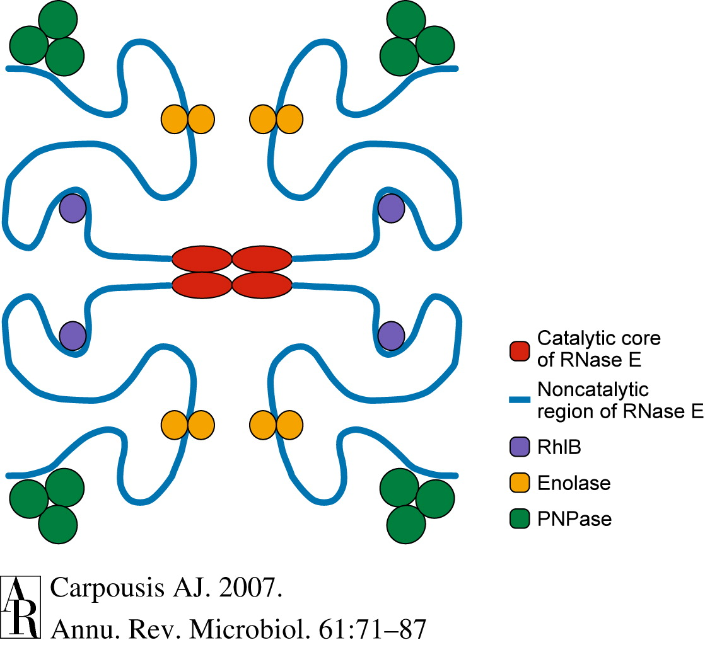

https://www.uniprot.org/uniprot/?query=ribonuclease+AND+organism%3A%22Escherichia+coli+%28strain+K12%29+%5B83333%5D%22&sort=score

* RNase E initially inactivates polyribosomal mRNA by cleaving in the translation initiation region
  or in the intercistronic regions of polycistronic messages. As the elongating ribosomes finish
  translating the functionally inactivated mRNA, RNase E further cleaves the ribosome-free mRNA.
* Fragments of mRNA produced by RNase E are digested to nucleotides by the exonucleases.
  * RNase II
  * RNase R
  * PNPase
* RNA helicase B (RhlB) and poly(A) polymerase (PAP) are accessory factors that facilitate
  exoribonucleolytic activity.
  * RhlB
  * PAP

* rne
  * Ribonuclease E
  * https://www.uniprot.org/uniprot/RNE_ECOLI
  * S1, RNase_E_G

* rnb
  * Exoribonuclease 2
  * https://www.uniprot.org/uniprot/RNB_ECOLI
  * OB_RNB, CSD2, RNB, S1

* rnr
  * Ribonuclease R
  * https://www.uniprot.org/uniprot/RNR_ECOLI
  * HTH_12, OB_RNB, CSD2, RNB, S1

* pnp
  * Polyribonucleotide nucleotidyltransferase
  * https://www.uniprot.org/uniprot/PNP_ECOLI
  * RNase_PH, RNase_PH_C, PNPase, RNase_PH, RNase_PH_C, KH_1, S1

* rhlB
  * ATP-dependent RNA helicase RhlB
  * https://www.uniprot.org/uniprot/RHLB_ECOLI
  * DEAD, Helicase_C

* eno
  * Enolase
  * https://www.uniprot.org/uniprot/ENO_ECOLI
  * Enolase_N, Enolase_C

* pcnB
  * Poly(A) polymerase I
  * https://www.uniprot.org/uniprot/PCNB_ECOLI
  * PolyA_pol, PolyA_pol_RNAbd, PolyA_pol_arg_C

RNE_ECOLI has binary interactions with 5 proteins:

* SRMB_ECOLI
* PNP_ECOLI
* DNAK_ECOLI
* RHLB_ECOLI
* ENO_ECOLI

* srmB
  * ATP-dependent RNA helicase SrmB
  * https://www.uniprot.org/uniprot/SRMB_ECOLI
  * DEAD, Helicase_C

* dnaK
  * Chaperone protein DnaK
  * https://www.uniprot.org/uniprot/DNAK_ECOLI
  * HSP70 (PF00012)

## The Gram-Positive Bacterial RNA Degradosome

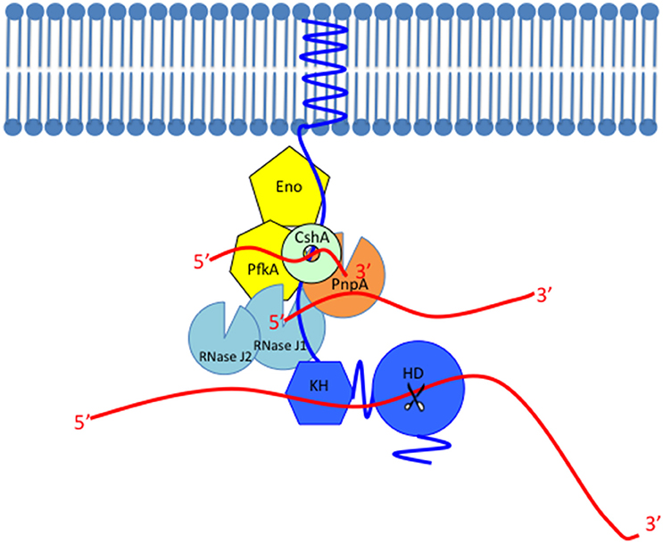

https://www.uniprot.org/uniprot/?query=Ribonuclease+AND+organism%3A%22Bacillus+subtilis+%28strain+168%29+%5B224308%5D%22&sort=score

* RNase E ==> RNase Y, RNase J1 and J2
* PNPase == PNPase
* RhlB ==> CshA
* Enolase ==> Enolase and PFK

* rny
  * Ribonuclease Y
  * https://www.uniprot.org/uniprot/RNY_BACSU
  * DUF3552, KH_1, HD

* rnjA
  * Ribonuclease J1
  * https://www.uniprot.org/uniprot/RNJ1_BACSU
  * Lactamase_B, RMMBL, RNase_J_C

* rnjB
  * Ribonuclease J2
  * https://www.uniprot.org/uniprot/RNJ2_BACSU
  * Lactamase_B, RMMBL, RNase_J_C

* cshA
  * DEAD-box ATP-dependent RNA helicase CshA
  * https://www.uniprot.org/uniprot/CSHA_BACSU
  * DEAD, Helicase_C

* pfkA
  * ATP-dependent 6-phosphofructokinase
  * https://www.uniprot.org/uniprot/PFKA_BACSU
  * PFK (PF00365)

* pnp
  * Polyribonucleotide nucleotidyltransferase
  * https://www.uniprot.org/uniprot/PNP_BACSU
  * RNase_PH, RNase_PH_C, PNPase, RNase_PH, RNase_PH_C, KH_1, S1

## Proteins containing S1 domain in E. coli

* rpsA
  * 30S ribosomal protein S1
  * https://www.uniprot.org/uniprot/RS1_ECOLI
  * 6 X S1

* rng
  * Ribonuclease G
  * https://www.uniprot.org/uniprot/RNG_ECOLI
  * S1, RNase_E_G

* nusA
  * Transcription termination/antitermination protein NusA
  * https://www.uniprot.org/uniprot/NUSA_ECOLI
  * NusA_N, S1, KH_5, HHH_5

* yhgF
  * Protein YhgF
  * https://www.uniprot.org/uniprot/YHGF_ECOLI
  * Tex_N, Tex_YqgF, HHH_3, HHH_9, S1

## Other RNases

* endo

  * rna
    * Ribonuclease I
    * https://www.uniprot.org/uniprot/RNI_ECOLI
    * Ribonuclease_T2
  * rnc
    * Ribonuclease 3
    * https://www.uniprot.org/uniprot/RNC_ECOLI
    * Ribonucleas_3_3, dsrm
    * Digests double-stranded RNA formed within single-strand substrates, but not RNA-DNA hybrids.
      Involved in the processing of rRNA precursors, viral transcripts, some mRNAs and at least 1
      tRNA.
  * rnpA
    * Ribonuclease P protein component
    * https://www.uniprot.org/uniprot/RNPA_ECOLI
    * Ribonuclease_P
    * Endonucleolytic cleavage of RNA, removing 5'-extranucleotides from tRNA precursor.
  * rnhA
    * Ribonuclease HI
    * https://www.uniprot.org/uniprot/RNH_ECOLI
    * RNase_H
    * Endonuclease that specifically degrades the RNA of RNA-DNA hybrids.
  * rnhB
    * Ribonuclease HII
    * https://www.uniprot.org/uniprot/RNH2_ECOLI
    * RNase_HII
    * Endonuclease that specifically degrades the RNA of RNA-DNA hybrids.
  * rnhC
    * Ribonuclease HIII
    * https://www.uniprot.org/uniprot/RNH3_BACSU
    * RDUF3378, Nase_HII
    * Endonuclease that specifically degrades the RNA of RNA-DNA hybrids.
  * rbn
    * Ribonuclease BN
    * https://www.uniprot.org/uniprot/RBN_ECOLI
    * Lactamase_B_2

* exo

  * rnd
    * Ribonuclease D
    * https://www.uniprot.org/uniprot/RND_ECOLI
    * DNA_pol_A_exo1, HRDC
    * Exonuclease involved in the 3' processing of various precursor tRNAs.
  * rnt
    * Ribonuclease T
    * https://www.uniprot.org/uniprot/RNT_ECOLI
    * RNase_T
    * Trims short 3' overhangs of a variety of RNA species, leaving a one or two nucleotide 3'
      overhang.
  * rph
    * Ribonuclease PH
    * https://www.uniprot.org/uniprot/RNPH_BACSU
    * RNase_PH, RNase_PH_C
  * nrnA
    * Bifunctional oligoribonuclease and PAP phosphatase NrnA
    * https://www.uniprot.org/uniprot/NRNA_BACSU
    * DHH, DHHA1

# Intriguing domains

## Domain organisation of RNase R

### E. coli RNase R

* [UniProt](https://www.uniprot.org/uniprot/RNR_ECOLI)


### E. coli RNase II

* [UniProt](https://www.uniprot.org/uniprot/RNB_ECOLI)


### Human RRP44

* [UniProt](https://www.uniprot.org/uniprot/RRP44_HUMAN)
* Subcellular location: Nucleus


### Fly Dis3

* [UniProt](https://www.uniprot.org/uniprot/Q9VC93)
* Subcellular location: Nucleus


### Yeast RRP44

* [UniProt](https://www.uniprot.org/uniprot/RRP44_YEAST)
* Subcellular location: Nucleus, Mitochondrion


### Arabidopsis thaliana RP44A

* [UniProt](https://www.uniprot.org/uniprot/RP44A_ARATH)
* Subcellular location: Nucleus


## hmmer.org HMMSCAN Results

| 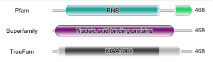 |
|:--------------------------------------------------------------------:|
|                       Am_med_U32_YP_003763410                        |

| 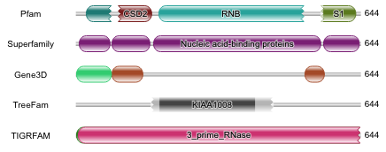 |
|:--------------------------------------------------------------------------------:|
|                          Es_coli_K_12_MG1655_NP_415802                           |

| 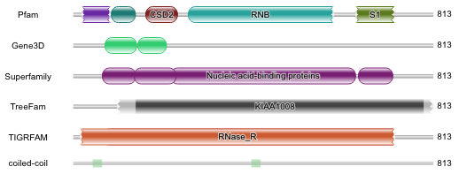 |
|:--------------------------------------------------------------------------------:|
|                          Es_coli_K_12_MG1655_NP_418600                           |

| 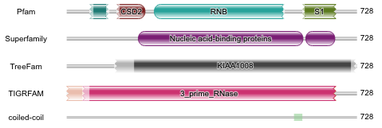 |
|:------------------------------------------------------------------------:|
|                        Ac_lai_PG_8A_WP_012242357                         |

| 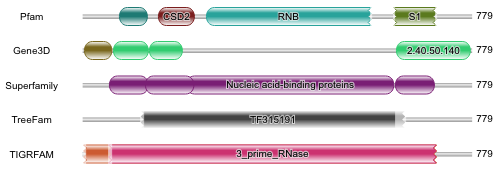 |
|:----------------------------------------------------------------------------------:|
|                           Ba_subt_subtilis_168_NP_391241                           |

| 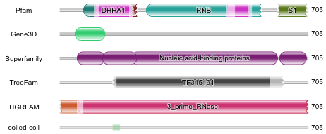 |
|:----------------------------------------------------------------------------:|
|                         Sp_mell_IPMB4A_WP_004029051                          |

| 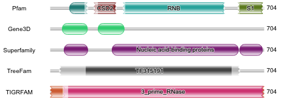 |
|:----------------------------------------------------------------------------------:|
|                           En_lum_ATCC_49195_WP_025734730                           |

| 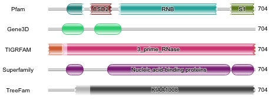 |
|:------------------------------------------------------------------:|
|                       Me_florum_L1_YP_053450                       |

| 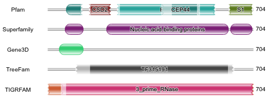 |
|:--------------------------------------------------------------------------------------------------------:|
|                                My_cap_capricolum_ATCC_27343_WP_011386996                                 |

|  |
|:--------------------------------------------------------------------:|
|                       My_put_KS1_WP_014034866                        |

|  |
|:--------------------------------------------------------------:|
|                      My_hyor_WP_014335631                      |

| 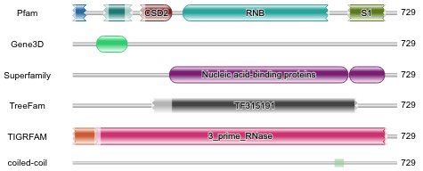 |
|:------------------------------------------------------------------------------:|
|                          My_bovis_CQ_W70_WP_013456627                          |

|  |
|:----------------------------------------------------------------------------:|
|                         My_canis_PG_14_WP_004794628                          |

| 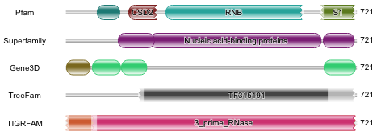 |
|:--------------------------------------------------------------------------------------:|
|                            U_ure_10_ATCC_33699_WP_012560232                            |

|  |
|:------------------------------------------------------------------:|
|                       My_gallis_WP_011113707                       |

| 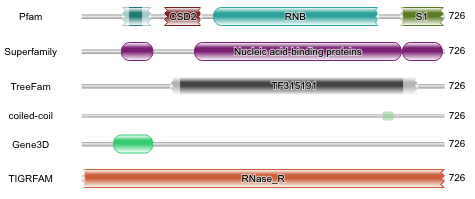 |
|:------------------------------------------------------------:|
|                     My_pne_WP_014325416                      |

| 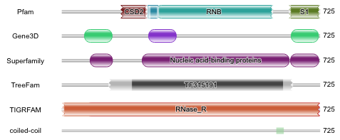 |
|:--------------------------------------------------------------------:|
|                       My_gen_G37_WP_009885662                        |

## Domains of RNases and Cooperators

* RNase II/R
  * OB_RNB (PF08206)
  * CSD2 (PF17876)
  * RNB (PF00773)
  * S1 (PF00575)

  * HTH_12 (PF08461)
  * RNase_II_C_S1 (PF18614)
  * Importin_rep (PF18773)

* Dis3
  * PIN_4 (PF13638)
  * Rrp44_CSD1 (PF17216)
  * OB_Dis3 (PF17849)
  * Rrp44_S1 (PF17215)

* RNase E
  * RNase_E_G (PF10150)

* PNPase
  * RNase_PH (PF01138)
  * RNase_PH_C (PF03725)
  * PNPase (PF03726)
  * KH_1 (PF00013)

* RhlB
  * DEAD (PF00270)
  * Helicase_C (PF00271)

* Poly(A) polymerase I
  * PolyA_pol (PF01743)
  * PolyA_pol_RNAbd (PF12627)
  * PolyA_pol_arg_C (PF12626)

* Enolase
  * Enolase_N (PF03952)
  * Enolase_C (PF00113)

* RNase Y
  * RNase_Y_N (PF12072)
  * ~~HD (PF01966)~~

* RNase J1/J2
  * Lactamase_B (PF00753)
  * RMMBL (PF07521)
  * RNase_J_C (PF17770)

* ATP-dependent 6-phosphofructokinase
  * PFK (PF00365)

* Ribonuclease I
  * Ribonuclease_T2 (PF00445)

* Ribonuclease 3
  * Ribonucleas_3_3 (PF14622)
  * dsrm (PF00035)

* Ribonuclease P protein component
  * Ribonuclease_P (PF00825)

* Ribonuclease H
  * RNase_H (PF00075)
  * RNase_HII (PF01351)
  * DUF3378 (PF11858)

* Ribonuclease BN
  * Lactamase_B_2 (PF12706)

* Ribonuclease D
  * DNA_pol_A_exo1 (PF01612)
  * HRDC (PF00570)

* Ribonuclease T
  * RNase_T (PF00929)

* Bifunctional oligoribonuclease and PAP phosphatase NrnA
  * DHH (PF01368)
  * DHHA1 (PF02272)

```shell script
cd ~/data/alignment/Tenericutes

mkdir -p DOMAINS/HMM
cd DOMAINS/HMM

for ID in \
    PF08206 PF17876 PF00773 PF00575 \
    PF08461 PF18614 PF18773 \
    PF13638 PF17216 PF17849 PF17215 \
    PF10150 PF01138 PF03725 PF03726 PF00013 \
    PF00270 PF00271 \
    PF01743 PF12627 PF12626 \
    PF03952 PF00113 \
    PF12072 \
    PF00753 PF07521 PF17770 \
    PF00365 \
    PF00445 \
    PF14622 PF00035 \
    PF00825 \
    PF00075 PF01351 PF11858 \
    PF12706 \
    PF01612 PF00570 \
    PF00929 \
    PF01368 PF02272 \
    ; do
    wget -N --content-disposition http://pfam.xfam.org/family/${ID}/hmm
done

```

## Scan every domains

```shell script
E_VALUE=1e-3

cd ~/data/alignment/Tenericutes

for domain in \
    OB_RNB CSD2 RNB S1 \
    HTH_12 RNase_II_C_S1 Importin_rep \
    PIN_4 Rrp44_CSD1 OB_Dis3 Rrp44_S1 \
    RNase_E_G RNase_PH RNase_PH_C PNPase KH_1 \
    DEAD Helicase_C \
    PolyA_pol PolyA_pol_RNAbd PolyA_pol_arg_C \
    Enolase_N Enolase_C \
    RNase_Y_N \
    Lactamase_B RMMBL RNase_J_C \
    PFK \
    Ribonuclease_T2 \
    Ribonucleas_3_3 dsrm \
    Ribonuclease_P \
    RNase_H RNase_HII DUF3378 \
    Lactamase_B_2 \
    DNA_pol_A_exo1 HRDC \
    RNase_T \
    DHH DHHA1 \
    ; do
    echo ${domain}
done \
    > domain.list

for domain in $(cat domain.list); do
    echo 1>&2 "==> domain [${domain}]"

    for GENUS in $(cat genus.list); do
        echo 1>&2 "==> GENUS [${GENUS}]"

        for STRAIN in $(cat taxon/${GENUS}); do
            gzip -dcf ASSEMBLY/${STRAIN}/*_protein.faa.gz |
                hmmsearch -E ${E_VALUE} --domE ${E_VALUE} --noali --notextw DOMAINS/HMM/${domain}.hmm - |
                grep '>>' |
                STRAIN=${STRAIN} perl -nl -e '
                    />>\s+(\S+)/ or next;
                    $n = $1;
                    $s = $n;
                    $s =~ s/\.\d+//;
                    printf qq{%s\t%s_%s\n}, $n, $ENV{STRAIN}, $s;
                '
        done
    done \
        > DOMAINS/${domain}.replace.tsv

    echo 1>&2
done

for domain in $(cat domain.list); do
    wc -l DOMAINS/${domain}.replace.tsv
done |
    datamash reverse -W |
    (echo -e "Domain\tCount" && cat) |
    mlr --itsv --omd cat

```

| Domain                              | Count |
|:------------------------------------|------:|
| DOMAINS/OB_RNB.replace.tsv          |   389 |
| DOMAINS/CSD2.replace.tsv            |   288 |
| DOMAINS/RNB.replace.tsv             |   328 |
| DOMAINS/S1.replace.tsv              |   845 |
| DOMAINS/HTH_12.replace.tsv          |   109 |
| DOMAINS/RNase_II_C_S1.replace.tsv   |    96 |
| DOMAINS/Importin_rep.replace.tsv    |     6 |
| DOMAINS/PIN_4.replace.tsv           |    10 |
| DOMAINS/Rrp44_CSD1.replace.tsv      |     5 |
| DOMAINS/OB_Dis3.replace.tsv         |     4 |
| DOMAINS/Rrp44_S1.replace.tsv        |     0 |
| DOMAINS/RNase_E_G.replace.tsv       |    20 |
| DOMAINS/RNase_PH.replace.tsv        |    80 |
| DOMAINS/RNase_PH_C.replace.tsv      |    88 |
| DOMAINS/PNPase.replace.tsv          |    72 |
| DOMAINS/KH_1.replace.tsv            |   469 |
| DOMAINS/DEAD.replace.tsv            |  2355 |
| DOMAINS/Helicase_C.replace.tsv      |  1468 |
| DOMAINS/PolyA_pol.replace.tsv       |    60 |
| DOMAINS/PolyA_pol_RNAbd.replace.tsv |    80 |
| DOMAINS/PolyA_pol_arg_C.replace.tsv |     6 |
| DOMAINS/Enolase_N.replace.tsv       |   346 |
| DOMAINS/Enolase_C.replace.tsv       |   350 |
| DOMAINS/RNase_Y_N.replace.tsv       |   250 |
| DOMAINS/Lactamase_B.replace.tsv     |   745 |
| DOMAINS/RMMBL.replace.tsv           |   482 |
| DOMAINS/RNase_J_C.replace.tsv       |   680 |
| DOMAINS/PFK.replace.tsv             |   319 |
| DOMAINS/Ribonuclease_T2.replace.tsv |     3 |
| DOMAINS/Ribonucleas_3_3.replace.tsv |   357 |
| DOMAINS/dsrm.replace.tsv            |   323 |
| DOMAINS/Ribonuclease_P.replace.tsv  |   351 |
| DOMAINS/RNase_H.replace.tsv         |    88 |
| DOMAINS/RNase_HII.replace.tsv       |   483 |
| DOMAINS/DUF3378.replace.tsv         |    75 |
| DOMAINS/Lactamase_B_2.replace.tsv   |   692 |
| DOMAINS/DNA_pol_A_exo1.replace.tsv  |   125 |
| DOMAINS/HRDC.replace.tsv            |    46 |
| DOMAINS/RNase_T.replace.tsv         |   445 |
| DOMAINS/DHH.replace.tsv             |   822 |
| DOMAINS/DHHA1.replace.tsv           |  1092 |

```shell script
cd ~/data/alignment/Tenericutes

# All proteins appeared
find DOMAINS/ -name "*.replace.tsv" |
    sort |
    parallel -j 1 'cut -f 2 {}' |
    sort -u \
    > DOMAINS/domains.tsv
wc -l DOMAINS/domains.tsv
#8964 DOMAINS/domains.tsv

# Status of domains
for domain in $(cat domain.list); do
    echo 1>&2 "==> domain [${domain}]"

    tsv-join \
        DOMAINS/domains.tsv \
        --data-fields 1 \
        -f <(
            cat DOMAINS/${domain}.replace.tsv |
                perl -nla -e 'print qq{$F[1]\tO}'
        ) \
        --key-fields 1 \
        --append-fields 2 \
        --write-all "" \
        > DOMAINS/tmp.tsv

    mv DOMAINS/tmp.tsv DOMAINS/domains.tsv
done

datamash check < DOMAINS/domains.tsv
#8964 lines, 42 fields

# Add header line
for domain in $(cat domain.list); do
    echo "${domain}"
done |
    (echo -e "#name" && cat) |
    paste -s -d $'\t' - \
    > DOMAINS/header.tsv

cat DOMAINS/header.tsv DOMAINS/domains.tsv \
    > temp && mv temp DOMAINS/domains.tsv

# Filter out DEAD or Helicase_C only sequences
cat DOMAINS/domains.tsv |
    tsv-filter -H --str-eq DEAD:O --str-eq Helicase_C:O \
    > DOMAINS/RhlB.tsv

# Filter out DHH or DHHA1 only sequences
cat DOMAINS/domains.tsv |
    tsv-filter -H --str-eq DHH:O --str-eq DHHA1:O \
    > DOMAINS/NrnA.tsv

rm -fr temp
cat DOMAINS/domains.tsv |
    tsv-filter -H --str-ne DEAD:O --str-ne Helicase_C:O |
    tsv-filter -H --str-ne DHH:O --str-ne DHHA1:O |
    (cat && cat DOMAINS/RhlB.tsv) |
    (cat && cat DOMAINS/NrnA.tsv) |
    tsv-uniq |
    keep-header -- sort -k1,1 \
    > temp && mv temp DOMAINS/domains.tsv

tsv-join \
    PROTEINS/all.info.tsv \
    --data-fields 1 \
    -f DOMAINS/domains.tsv \
    --key-fields 1 \
    --append-fields 2-42 |
     keep-header -- sort -k1,1 \
    > temp && mv temp DOMAINS/domains.tsv

datamash check < DOMAINS/domains.tsv
#7272 lines, 45 fields

rm DOMAINS/header.tsv DOMAINS/RhlB.tsv DOMAINS/NrnA.tsv

```

## InterProScan

InterProScan 启动很慢, 因此一次提交整个菌株里的数十个蛋白.

```shell script
cd ~/data/alignment/Tenericutes

mkdir -p IPS

# extract wanted sequences
for GENUS in $(cat genus.list); do
    echo 1>&2 "==> GENUS [${GENUS}]"

    for STRAIN in $(cat taxon/${GENUS}); do
        mkdir -p IPS/${STRAIN}

        cat PROTEINS/all.info.tsv |
            tsv-filter --str-eq 2:${STRAIN} |
            cut -f 1 |
            grep -Fx -f <(cut -f 1 DOMAINS/domains.tsv) \
            > IPS/${STRAIN}/wanted.list

        faops some PROTEINS/all.replace.fa IPS/${STRAIN}/wanted.list IPS/${STRAIN}/${STRAIN}.fa
    done
done

# scan proteins of each strain with InterProScan
# By default InterProScan uses 8 cpu cores
for GENUS in $(cat genus.list); do
    echo 1>&2 "==> GENUS [${GENUS}]"

    cat taxon/${GENUS} |
        parallel --no-run-if-empty --linebuffer -k -j 4 "
            if [[ -e IPS/{}/{}.tsv ]]; then
                exit;
            fi

            interproscan.sh --cpu 4 -dp -f tsv,json,svg -i IPS/{}/{}.fa --output-file-base IPS/{}/{}
            mkdir -p IPS/{}/svg
            tar -xz -f IPS/{}/{}.svg.tar.gz -C IPS/{}/svg
            rm IPS/{}/{}.svg.tar.gz
        "

    echo 1>&2
done

# IPS family
for GENUS in $(cat genus.list); do
    echo 1>&2 "==> GENUS [${GENUS}]"

    for STRAIN in $(cat taxon/${GENUS}); do
        cat IPS/${STRAIN}/${STRAIN}.json |
            jq .results |
            jq -r -c '
                .[] |
                .xref as $name |
                .matches[] |
                .signature.entry |
                select(.type == "FAMILY") |
                [$name[0].name, .accession, .description] |
                @tsv
            ' |
            tsv-uniq -f 1
    done
done |
    (echo -e "#name\tfamily\tdescription" && cat) \
    > IPS/family.tsv

tsv-join \
    <(cut -f 1-4 DOMAINS/domains.tsv) \
    --data-fields 1 \
    -f IPS/family.tsv \
    --key-fields 1 \
    --append-fields 2-3 \
    --write-all "" |
    tsv-join \
        --data-fields 1 \
        -f DOMAINS/domains.tsv \
        --key-fields 1 \
        --append-fields 5-45 |
     keep-header -- sort -k1,1 \
    > IPS/predicts.tsv

cut -f 4 IPS/predicts.tsv |
    sort |
    uniq -c |
    sort -nr

cut -f 6 IPS/predicts.tsv |
    sort |
    uniq -dc |
    sort -nr

cat IPS/predicts.tsv |
    tsv-filter -H -v --str-in-fld 4:"DUF" --empty 6 |
    tsv-filter -H -v --str-in-fld 4:"DUF" --str-in-fld 6:"DUF" |
    tsv-filter -H -v --istr-in-fld 4:"hypothetical" --empty 6 |
    tsv-filter -H -v --istr-in-fld 4:"putative" --empty 6 |
    tsv-filter -H -v --istr-in-fld 4:"DNA polymerase" --istr-in-fld 6:"DNA polymerase" |
    tsv-filter -H -v --or --istr-in-fld 4:"Ribosomal protein" --istr-in-fld 6:"Ribosomal protein" |
    tsv-filter -H -v --or --istr-in-fld 4:"Restriction" --istr-in-fld 6:"Restriction" |
    tsv-filter -H -v --or --istr-in-fld 4:"primosomal protein" --istr-in-fld 6:"primosomal protein" |
    tsv-filter -H -v --or --str-in-fld 4:"Uvr" --str-in-fld 6:"Uvr" |
    tsv-filter -H -v --or --str-in-fld 4:"NusA" --str-in-fld 6:"NusA" |
    tsv-filter -H -v --or --str-in-fld 4:"SecA" --str-in-fld 6:"SecA" |
    tsv-filter -H -v --or --str-in-fld 4:"HrcA" --str-in-fld 6:"HrcA" |
    tsv-filter -H -v --or --str-in-fld 4:"RecJ" --str-in-fld 6:"RecJ" |
    tsv-filter -H -v --or --str-in-fld 4:"RecG" --str-in-fld 6:"RecG" |
    tsv-filter -H -v --or --str-in-fld 4:"RecQ" --str-in-fld 6:"RecQ" |
    tsv-filter -H -v --istr-in-fld 4:"MBL fold" --empty 6 |
    tsv-filter -H -v --istr-in-fld 4:"DEAD/DEAH box helicase" --empty 6 |
    tsv-filter -H -v --istr-in-fld 4:"DHH family" --empty 6 |
    tsv-filter -H -v --istr-in-fld 4:"DHH family" --istr-in-fld 6:"Cyclic-di-AMP phosphodiesterase" |
    tsv-filter -H -v --str-in-fld 4:"tRNA" --empty 6 |
    tsv-filter -H -v --str-in-fld 4:"tRNA" --str-in-fld 6:"tRNA" |
    tsv-filter -H -v --istr-in-fld 4:"transposase" --empty 6 |
    tsv-filter -H -v --istr-in-fld 4:"transcriptional accessory" --empty 6 |
    tsv-filter -H -v --istr-in-fld 6:"Cold shock, CspA" |
    tsv-filter -H -v --istr-in-fld 4:"DNA helicase" --empty 6 \
    > IPS/predicts.filter.tsv

cut -f 6 IPS/predicts.filter.tsv |
    sort |
    uniq -c |
    sort -nr

cat IPS/predicts.filter.tsv |
    tsv-filter -H --empty 6 |
    cut -f 4 |
    sort |
    uniq -c |
    sort -nr

plotr tsv IPS/predicts.filter.tsv \
    --header \
    --contain 4:ribonuclease \
    --contain 4:rnase \
    --contain 4:enolase \
    --contain 6:ribonuclease \
    --contain 6:enolase

```

# *Mycoplasma* degradosomes and RNases

| Item                                      | Present? |
|:------------------------------------------|---------:|
| **Shared**                                |          |
| Ribonuclease II/R                         |      all |
| Enolase                                   |      all |
| PNPase                                    |          |
| **Gram-negative**                         |          |
| Ribonuclease E                            |          |
| RNA helicase B (RhlB)                     |          |
| Poly(A) polymerase (PAP)                  |          |
| **Gram-positive**                         |          |
| Ribonuclease Y                            |     half |
| Ribonuclease J                            |      all |
| RNA helicase CshA                         |          |
| ATP-dependent 6-phosphofructokinase (PFK) |      all |


| Item                  | Present? |
|:----------------------|---------:|
| **endo**              |          |
| Ribonuclease I/T      |          |
| Ribonuclease III      |      all |
| Ribonuclease P        |      all |
| Ribonuclease H/HI     |     part |
| Ribonuclease HII/HIII |      all |
| NrnA                  |      all |
| **exo**               |          |
| Ribonuclease D        |          |
| Ribonuclease T        |          |
| Ribonuclease PH       |          |
| NrnA                  |      all |


# We can't trust annotations

## Stats of annotations and HMM models of RNase R

| Item               | Count |
|:-------------------|------:|
| "ribonuclease R "  |   305 |
| "ribonuclease II " |     4 |
| " RNB "            |     8 |
| "RNase R "         |     2 |
| "RNase II "        |     8 |
| OB_RNB             |   203 |
| CSD2               |   203 |
| RNB                |   235 |
| S1                 |   217 |

```shell script
cd ~/data/alignment/Tenericutes

mkdir -p RNaseR

# Annotations of proteins containing the RNB domain
cat PROTEINS/all.pro.fa |
    grep "^>" |
    grep -f <(cut -f 1 DOMAINS/RNB.replace.tsv) |
    perl -nl -e 's/^>\w+\.\d+\s+//g; print' |
    perl -nl -e 's/\s+\[.+?\]$//g; print' |
    perl -nl -e 's/MULTISPECIES: //g; print' |
    sort |
    uniq -c |
    sort -nr

cat PROTEINS/all.pro.fa |
    grep "ribonuclease R " |
    wc -l
cat PROTEINS/all.pro.fa |
    grep "ribonuclease II " |
    wc -l
cat PROTEINS/all.pro.fa |
    grep " RNB " |
    wc -l
cat PROTEINS/all.pro.fa |
    grep "RNase R " |
    wc -l
cat PROTEINS/all.pro.fa |
    grep "RNase II " |
    wc -l

faops some PROTEINS/all.pro.fa \
    <(cat PROTEINS/all.pro.fa |
        grep -e "ribonuclease R " -e "ribonuclease II " -e " RNB " -e "RNase R " -e "RNase II " |
        cut -d" " -f 1 |
        sed "s/^>//" |
        sort | uniq) \
    stdout |
    faops filter -u stdin stdout \
    > RNaseR/RNaseR.all.fa

cat RNaseR/RNaseR.all.fa |
    grep "^>" |
    wc -l
for domain in OB_RNB CSD2 RNB S1; do
    cat RNaseR/RNaseR.all.fa |
        grep "^>" |
        sed "s/^>//" |
        grep -Fx -f <(cut -f 1 DOMAINS/${domain}.replace.tsv) |
        wc -l
done

# Strains and RNase R
find ASSEMBLY -maxdepth 1 -type d |
    sort |
    grep 'ASSEMBLY/' |
    parallel --no-run-if-empty --linebuffer -k -j 4 '
        gzip -dcf {}/*_protein.faa.gz |
            grep -e "ribonuclease R " -e "ribonuclease II " -e " RNB " -e "RNase R " -e "RNase II " |
            (echo {} && cat)
        echo
    ' \
    > RNaseR/strain_anno.txt

# Annotated as RNase R but lacking RNB domains:
cat PROTEINS/all.pro.fa |
    grep "^>" |
    grep -e "ribonuclease R " -e "ribonuclease II " -e " RNB " -e "RNase R " -e "RNase II " |
    grep -v -f <(cut -f 1 DOMAINS/RNB.replace.tsv)
#>VEU63217.1 exoribonuclease II [Mycoplasma fermentans]
#>AEG72387.1 ribonuclease R [Mycoplasma haemofelis Ohio2]
#>WP_112665413.1 ribonuclease R [Mycoplasma wenyonii]
#>NP_462407.3 putative RNase R [Salmonella enterica subsp. enterica serovar Typhimurium str. LT2]

```

# Find RNases and Cooperators

| family    | description                               | count |
|:----------|:------------------------------------------|:------|
| IPR008226 | Mini-ribonuclease 3 family                | 6     |
| IPR022894 | Oligoribonuclease                         | 8     |
| IPR000100 | Ribonuclease P                            | 350   |
| IPR001352 | Ribonuclease HII/HIII                     | 264   |
| IPR001568 | Ribonuclease T2-like                      | 2     |
| IPR002381 | Ribonuclease PH, bacterial-type           | 12    |
| IPR004476 | Ribonuclease II/ribonuclease R            | 115   |
| IPR004613 | Ribonuclease J                            | 300   |
| IPR004641 | Ribonuclease HIII                         | 79    |
| IPR004659 | Ribonuclease E/G                          | 7     |
| IPR005987 | Ribonuclease T                            | 4     |
| IPR006292 | Ribonuclease D                            | 5     |
| IPR011804 | Ribonuclease II                           | 2     |
| IPR011805 | Ribonuclease R                            | 195   |
| IPR011907 | Ribonuclease III                          | 340   |
| IPR013469 | Ribonuclease BN                           | 1     |
| IPR013471 | Ribonuclease Z/BN                         | 8     |
| IPR017290 | Ribonuclease H, Bacteroides-type          | 30    |
| IPR017705 | Ribonuclease Y                            | 176   |
| IPR022892 | Ribonuclease HI                           | 13    |
| IPR022898 | Ribonuclease HII                          | 126   |
| IPR028878 | Ribonuclease E                            | 2     |
| IPR030854 | Ribonuclease J, bacteria                  | 170   |
| IPR039378 | Ribonuclease T2, prokaryotic              | 1     |
| IPR019307 | RNA-binding protein AU-1/Ribonuclease E/G | 7     |

```shell script
cd ~/data/alignment/Tenericutes

cat IPS/predicts.filter.tsv |
    tsv-filter -H --istr-in-fld description:"Ribonuclease" |
    cut -f 5,6 |
    tsv-summarize -H --group-by 1,2 --count |
    grep -v "deoxy" |
    keep-header -- sort -k2,2 |
    mlr --itsv --omd cat

mkdir -p RNases

cat IPS/predicts.filter.tsv |
    tsv-filter -H --or \
        --istr-eq description:"Ribonuclease II" \
        --istr-eq description:"Ribonuclease R" \
        --istr-eq description:"Ribonuclease II/ribonuclease R" \
    > RNases/RNaseR.tmp

cat IPS/predicts.filter.tsv |
    tsv-filter -H --str-eq RNB:"O" |
    grep -e "ribonuclease R" -e "ribonuclease II" -e "RNB" -e "RNase R" -e "RNase II" \
    >> RNases/RNaseR.tmp

cat RNases/RNaseR.tmp |
    tsv-uniq \
    > RNases/RNaseR.tsv

plotr tsv RNases/RNaseR.tsv --header

rm RNases/*.tmp

```

## Find all RNase R

```shell script
cd ~/data/alignment/Tenericutes

# Find all genes
for GENUS in $(cat genus.list); do
    echo "==> GENUS [${GENUS}]"

    for STRAIN in $(cat taxon/${GENUS}); do
        gzip -dcf ASSEMBLY/${STRAIN}/*_protein.faa.gz |
            grep -e "ribonuclease R " -e "ribonuclease II " -e " RNB " -e "RNase R " -e "RNase II " |
            cut -d" " -f 1 |
            sed "s/^>//" |
            STRAIN=${STRAIN} perl -nl -MPath::Tiny -e '
                BEGIN {
                    our %seen = map {(split /\t/)[0] => 1}
                        grep {/\S/}
                        path(q{DOMAINS/RNB.replace.tsv})->lines({ chomp => 1});
                }

                $n = $_;
                $s = $n;
                $s =~ s/\.\d+//;
                if (exists $seen{$n}) {
                    printf qq{%s\t%s_%s\n}, $n, $ENV{STRAIN}, $s;
                }
                else {
                    printf STDERR qq{%s\t%s_%s\n}, $n, $ENV{STRAIN}, $s;
                }
            '
    done \
        > RNaseR/${GENUS}.replace.tsv
done

# 323
cat RNaseR/*.replace.tsv | wc -l

# extract sequences for each genus
for GENUS in $(cat genus.list); do
    echo "==> ${GENUS}"

    mytmpdir=`mktemp -d 2>/dev/null || mktemp -d -t 'mytmpdir'`

    # avoid duplicated fasta headers
    faops some PROTEINS/all.pro.fa RNaseR/${GENUS}.replace.tsv stdout |
        faops filter -u stdin ${mytmpdir}/${GENUS}.fa

    # avoid duplicated original names
    cat RNaseR/${GENUS}.replace.tsv |
        parallel --no-run-if-empty --linebuffer -k -j 1 "
            faops replace -s ${mytmpdir}/${GENUS}.fa <(echo {}) stdout
        " \
        > RNaseR/${GENUS}.pro.fa

    rm -fr ${mytmpdir}
done

# aligning with muscle
cat genus.list |
    parallel --no-run-if-empty --linebuffer -k -j 4 '
        echo "==> {}"

        muscle -quiet -in RNaseR/{}.pro.fa -out RNaseR/{}.aln.fa
    '

# newick trees
cat genus.list |
    parallel --no-run-if-empty --linebuffer -k -j 4 '
        echo "==> {}"

        FastTree -quiet RNaseR/{}.aln.fa > RNaseR/{}.aln.newick
    '

for GENUS in $(cat genus.list); do
    cat RNaseR/${GENUS}.pro.fa
done \
    > RNaseR/RNaseR.pro.fa

muscle -quiet -in RNaseR/RNaseR.pro.fa -out RNaseR/RNaseR.aln.fa
FastTree -quiet RNaseR/RNaseR.aln.fa > RNaseR/RNaseR.aln.newick

```

## Tweak the tree of RNaseR

```shell script
cd ~/data/alignment/Tenericutes

# reroot
nw_reroot RNaseR/RNaseR.aln.newick Am_med_U32_WP_013223097 > RNaseR/RNaseR.reroot.newick

nw_labels -I RNaseR/RNaseR.aln.newick > RNaseR.list

# strains in species
cat RNaseR.list |
    perl -nl -e '/([[:alpha:]]+_[[:alpha:]]+)/ and print $1' |
    perl -nl -e '!/_sp$/ and print' |
    sort |
    uniq -d -c |
    perl -nla -e 'print qq{$F[1]\t$F[1]___$F[0]}' \
    > species.count.tsv

# Check monophyly for species
rm species.monophyly.list species.paraphyly.list species.monophyly.map
cat species.count.tsv |
    perl -nl -MPath::Tiny -e '
        BEGIN {
            our @lists =
                grep {/\S/}
                path(q{RNaseR.list})->lines({ chomp => 1});
        }

        my @ns = split /\t/;
        my @sts = grep {/^$ns[0]/} @lists;

        my $cmd = q{nw_clade -m RNaseR/RNaseR.reroot.newick };
        $cmd .= " $_ " for @sts;
        $cmd .= " | nw_stats -f l - | cut -f 3";

        my $result = `$cmd`;
        if ($result) {
            print qq{$_ $ns[1]} for @sts;
            path(q{species.monophyly.list})->append($ns[0]);
        }
        else {
            path(q{species.paraphyly.list})->append($ns[0]);
        }
    ' \
    > species.monophyly.map

# Merge strains in species to higher-rank
nw_rename RNaseR/RNaseR.reroot.newick species.monophyly.map |
    nw_condense - \
    > RNaseR/RNaseR.map.newick

```

## RNB domain

```shell script
E_VALUE=1e-3

cd ~/data/alignment/Tenericutes

hmmsearch \
    -E ${E_VALUE} --domE ${E_VALUE} \
    -A RNaseR/RNB.sto DOMAINS/HMM/RNB.hmm RNaseR/RNaseR.pro.fa

esl-reformat fasta RNaseR/RNB.sto > RNaseR/RNB.pro.fa

muscle -quiet -in RNaseR/RNB.pro.fa -out RNaseR/RNB.aln.fa
FastTree -quiet RNaseR/RNB.aln.fa > RNaseR/RNB.aln.newick

# reroot
nw_reroot RNaseR/RNB.aln.newick Am_med_U32_WP_013223097/46-352 > RNaseR/RNB.reroot.newick

nw_labels -I RNaseR/RNB.aln.newick > RNB.list

# strains in species
cat RNB.list |
    perl -nl -e '/([[:alpha:]]+_[[:alpha:]]+)/ and print $1' |
    perl -nl -e '!/_sp$/ and print' |
    sort |
    uniq -d -c |
    perl -nla -e 'print qq{$F[1]\t$F[1]___$F[0]}' \
    > species.count.tsv

# Check monophyly for species
rm species.monophyly.list species.paraphyly.list species.monophyly.map
cat species.count.tsv |
    perl -nl -MPath::Tiny -e '
        BEGIN {
            our @lists =
                grep {/\S/}
                path(q{RNB.list})->lines({ chomp => 1});
        }

        my @ns = split /\t/;
        my @sts = grep {/^$ns[0]/} @lists;

        my $cmd = q{nw_clade -m RNaseR/RNB.reroot.newick };
        $cmd .= " $_ " for @sts;
        $cmd .= " | nw_stats -f l - | cut -f 3";

        my $result = `$cmd`;
        if ($result) {
            print qq{$_ $ns[1]} for @sts;
            path(q{species.monophyly.list})->append($ns[0]);
        }
        else {
            path(q{species.paraphyly.list})->append($ns[0]);
        }
    ' \
    > species.monophyly.map

# Merge strains in species to higher-rank
nw_rename RNaseR/RNB.reroot.newick species.monophyly.map |
    nw_condense - \
    > RNaseR/RNB.map.newick

```


## Importin_rep domain

```shell script
E_VALUE=1e-3

cd ~/data/alignment/Tenericutes

hmmsearch \
    -E ${E_VALUE} --domE ${E_VALUE} \
    -A RNaseR/Importin_rep.sto DOMAINS/HMM/Importin_rep.hmm RNaseR/RNaseR.pro.fa

esl-reformat fasta RNaseR/Importin_rep.sto > RNaseR/Importin_rep.pro.fa

muscle -quiet -in RNaseR/Importin_rep.pro.fa -out RNaseR/Importin_rep.aln.fa
FastTree -quiet RNaseR/Importin_rep.aln.fa > RNaseR/Importin_rep.aln.newick

```

# Collect CDS

## `all.cds.fa`

```shell script
cd ~/data/alignment/Tenericutes

mkdir -p CDS

# 348
find ASSEMBLY -type f -name "*_cds_from_genomic.fna.gz" |
    wc -l

# sed script converting from Contigs to Strain
for GENUS in $(cat genus.list); do
    echo 1>&2 "==> GENUS [${GENUS}]"

    for STRAIN in $(cat taxon/${GENUS}); do
        find ASSEMBLY/${STRAIN} -type f -name "*_genomic.fna.gz" |
            grep -v "_from_" |
            xargs gzip -dcf |
            grep '^>' |
            cut -d' ' -f 1 |
            sed 's/>//' |
            xargs -I{} echo -e "{}\t${STRAIN}"
    done
done \
    > CDS/contigs_to_strain.tsv

cat CDS/contigs_to_strain.tsv |
    perl -nla -e '
        print q{s/^>} . quotemeta($F[0]) . q{/>} . quotemeta($F[1]) . q{/g;};
    ' \
    > CDS/sed.script

wc -l CDS/sed.script
# 5726

for GENUS in $(cat genus.list); do
    echo 1>&2 "==> GENUS [${GENUS}]"

    for STRAIN in $(cat taxon/${GENUS}); do
        gzip -dcf ASSEMBLY/${STRAIN}/*_cds_from_genomic.fna.gz
    done
done |
    perl -nl -e 's/^>lcl\|/>/g; print' |
    perl -nl -e 's/\s+\[.+?\]//g; print' \
    > CDS/all.cds.fa

```

## `RNaseR.cds.fa`

```shell script
cd ~/data/alignment/Tenericutes

for GENUS in $(cat genus.list); do
    echo 1>&2 "==> GENUS [${GENUS}]"

    cat CDS/all.cds.fa |
        grep '>' |
        grep -F -f <( cat RNaseR/${GENUS}.replace.tsv | cut -f 1 ) |
        sed 's/^>//'
done \
    > CDS/RNaseR.list

faops order CDS/all.cds.fa CDS/RNaseR.list stdout |
    sed -f CDS/sed.script \
    > CDS/RNaseR.cds.fa

```

# Tenericutes: run

```shell script
$(brew --prefix)/Cellar/$(brew list --versions repeatmasker | sed 's/ /\//')/libexec/util/queryRepeatDatabase.pl \
    -stat -species Bacteria
```

* Rsync to hpcc

```shell script
rsync -avP \
    ~/data/alignment/Tenericutes/ \
    wangq@202.119.37.251:data/alignment/Tenericutes

# rsync -avP wangq@202.119.37.251:data/alignment/Tenericutes/ ~/data/alignment/Tenericutes

```

`--perseq` for RefSeq_category Reference Genome assemblies.

```shell script
cd ~/data/alignment/Tenericutes

# prep
egaz template \
    ASSEMBLY \
    --prep -o GENOMES \
    --perseq Mpne_M129 \
    --perseq Mflo_L1 \
    --perseq Mmyc_subsp_mycoides_SC_str_PG1 \
    --min 5000 --about 5000000 \
    -v --repeatmasker "--parallel 24"

bsub -q mpi -n 24 -J "T-0_prep" "bash GENOMES/0_prep.sh"

ls -t output.* | head -n 1 | xargs tail -f | grep "==>"

# gff
for n in Mpne_M129 Mflo_L1 Mmyc_subsp_mycoides_SC_str_PG1; do
    FILE_GFF=$(find ASSEMBLY -type f -name "*_genomic.gff.gz" | grep "${n}")
    echo >&2 "==> Processing ${n}/${FILE_GFF}"

    gzip -dcf ${FILE_GFF} > GENOMES/${n}/chr.gff
done

# multi
egaz template \
    GENOMES/Mpne_M129 \
    $(find GENOMES -maxdepth 1 -type d -path "*/????*" | grep -v "Mpne_M129") \
    --multi -o multi/ \
    --rawphylo --parallel 24 -v

bsub -q mpi -n 24 -J "T-1_pair" "bash multi/1_pair.sh"
bsub -w "ended(T-1_pair)" \
    -q mpi -n 24 -J "T-2_rawphylo" "bash multi/2_rawphylo.sh"
bsub  -w "ended(T-2_rawphylo)" \
    -q mpi -n 24 -J "T-3_multi" "bash multi/3_multi.sh"

# multi_Pfal
egaz template \
    GENOMES/Pfal_3D7 \
    $(find GENOMES -maxdepth 1 -type d -path "*/????*" | grep "Pfal_" | grep -v "Pfal_3D7") \
    GENOMES/Prei_SY57 \
    --multi -o multi/ \
    --multiname multi_Pfal --tree multi/Results/multi.nwk --outgroup Prei_SY57 \
    --parallel 24 -v

bsub -q mpi -n 24 -J "T-3_multi" "bash multi/3_multi.sh"

# self
egaz template \
    GENOMES/Pfal_3D7 GENOMES/Pber_ANKA GENOMES/Pcha_chabaudi \
    GENOMES/Pcyn_strain_B GENOMES/Pkno_strain_H \
    --self -o self/ \
    --circos --parallel 24 -v

bsub -q mpi -n 24 -J "T-1_self" "bash self/1_self.sh"
bsub -w "ended(T-1_self)" \
    -q mpi -n 24 -J "T-3_proc" "bash self/3_proc.sh"
bsub  -w "ended(T-3_proc)" \
    -q mpi -n 24 -J "T-4_circos" "bash self/4_circos.sh"

```

